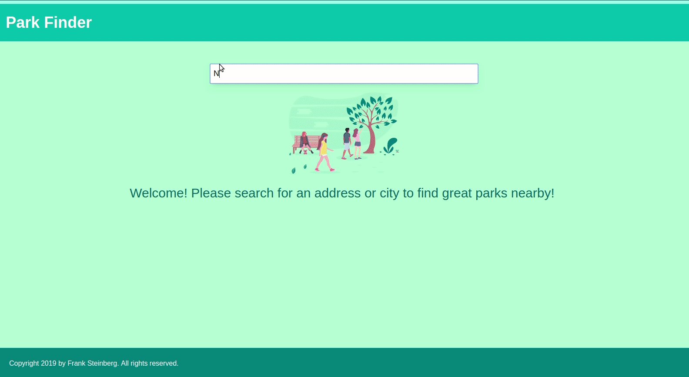
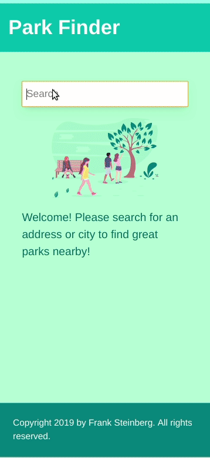

# Park Finder

This is a Google Maps demo project that will allow a user to search for an address or city, and see nearby Parks. The technologies used are Gridsome/Vue to create the Single-Page Application, Google Maps, Tailwind CSS

### 1. Install Gridsome CLI tool if you don't have it installed already

`npm install --global @gridsome/cli`

### 2. Install project dependencies

`npm install` assuming your npm is up to date

OR

`yarn` assuming your yarn is up to date

** I had to manually run `yarn add @fullhuman\postcss-purgecss`, you may need to as well

### 3. Serve the Demo

`gridsome develop` to serve the demo locally

### 4. Search for a location.

Gridsome should serve the site on `localhost:8080`. Once loaded, you will be prompted to search for a location (Ex: `Norfolk, VA`). You will be presented with a map of the location, and any parks nearby!

## Preview

### Large Screen

### Mobile Screen

## Other Resources Used

* [Using the Google Maps API with Vue.js (by Markus Oberlehner)](https://markus.oberlehner.net/blog/using-the-google-maps-api-with-vue/)
* [Tailwind and PurgeCSS Config for Gridsome (by Brandon Pittman)](https://www.brandonpittman.net/tailwind-purge-config/)
* [Google Maps Markers](https://github.com/Concept211/Google-Maps-Markers)
* [Google Maps API Documentation](https://developers.google.com/maps/documentation/)
* [Tailwind CSS Documentation](https://tailwindcss.com/docs/)
* [Gridsome Documentation](https://gridsome.org/docs/)
